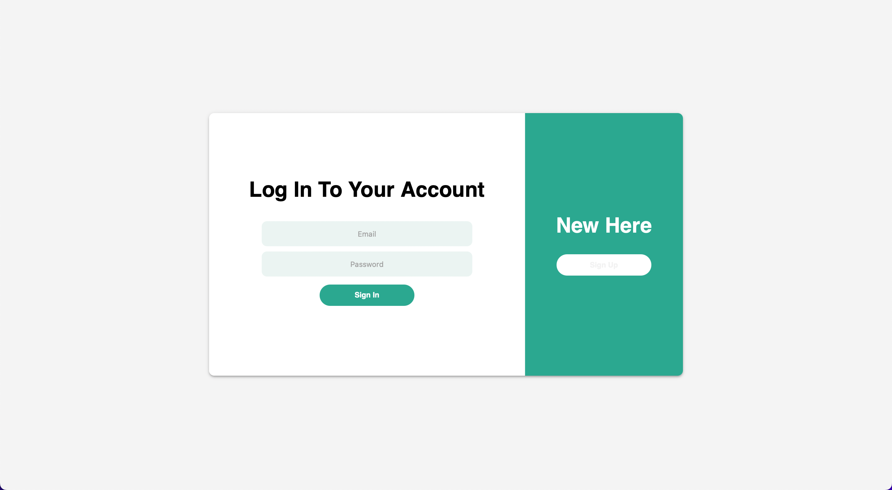
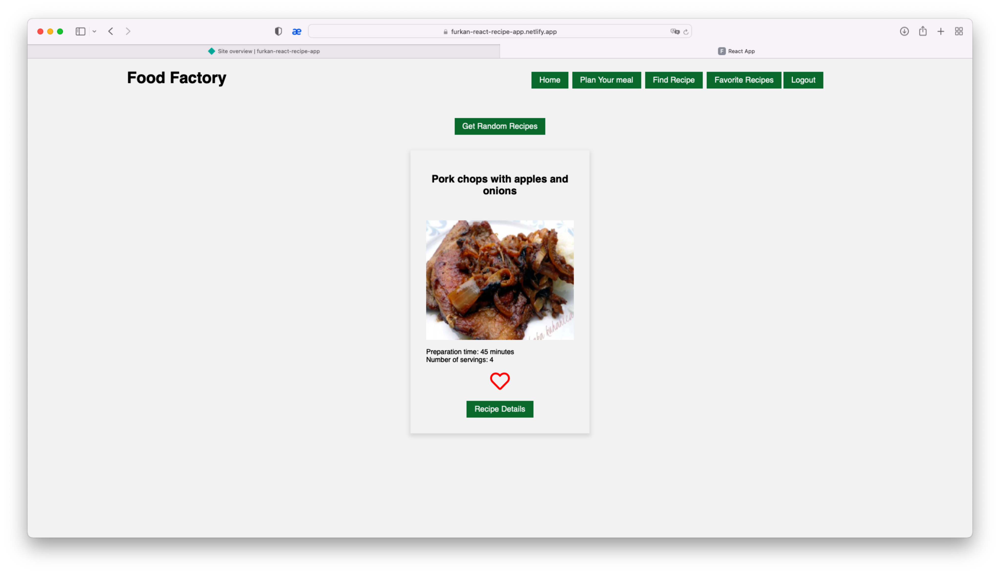
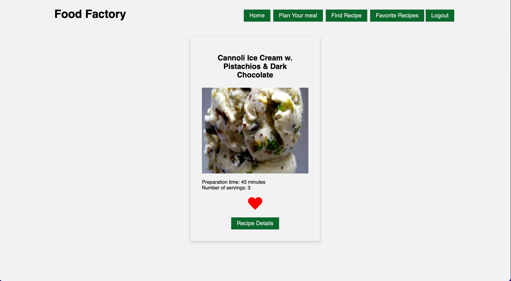
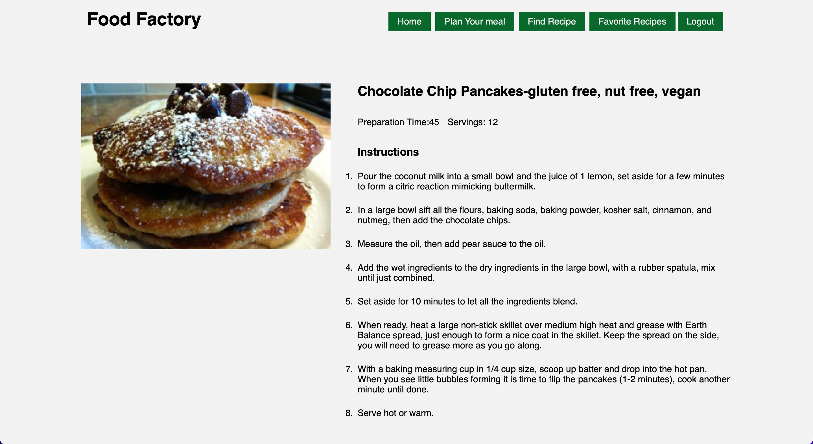
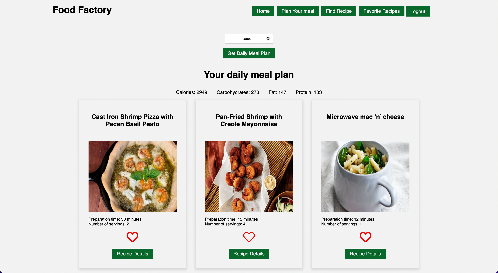
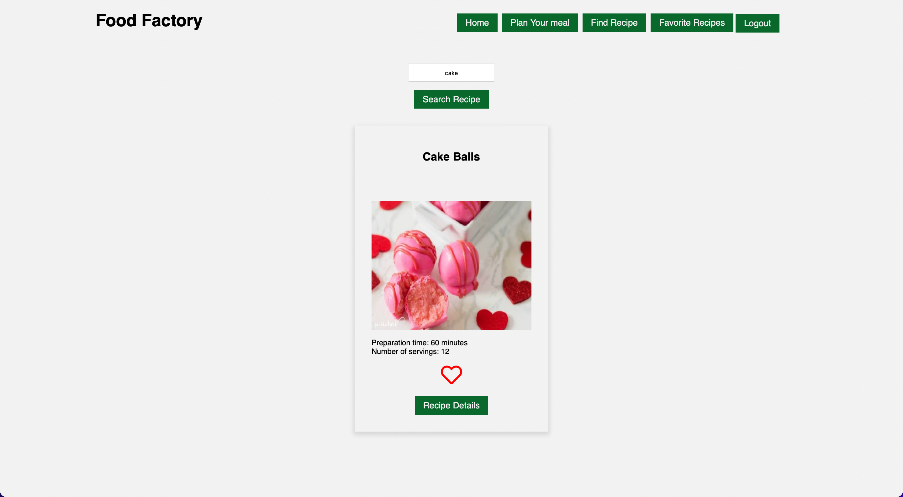

# Food Recipe Application

   

---

## How does application works?

1. To use the application **log in** is required. If the user **didn't sign up**, then **sign up** is required.
   

1. At the home page there is a button named **Get Random Recipe** which renders randomly a recipe from the [recipe api](https://spoonacular.com/food-api/docs#Get-Random-Recipes). _The rendered recipe number can be increased but due to api call limitation, only one render recipe is rendered._
   

   - with _Get Random Recipe_ feature, **per recipe title, image, cooking time and serving number** is rendered. Also below every recipe there is a **like** button and **Recipe Details** button. When clicked **like** button, recipe is stored in **favorite recipes** _which can be reached by clicking **Favorite Recipes** link in the navigation section which is at the top of the page_.

     
     In this page favorite recipes are rendered if there is no any favored recipe, it says ❤️Like Some Recipe❤️.

   - When clicked **Recipe details**, Recipe Details page is opened for that recipe.
     
     In this page, recipe details are rendered which are **image, title, preparation time, servings, instructions for preparation**.

1. In the navigation section there is **Plan Your Meals** link. When clicked, a new page is opened **with an input area which is for calories** and a button for **getting daily meal plan according to calories entered** by using [recipe api](https://spoonacular.com/food-api/docs#Get-Meal-Plan-Day)

   
   In this page daily meal plan is rendered according to calorie amount entered. Also for every recipe details can be seen when clicked on _Recipe Details_ button.

1. In the navigation section there is **Find Recipe** link. When clicked, a new page is opened **with an input area which is for name, ingredients etc related to a recipe** and a button for **Searching Recipe**. _Due to api call limit only one result is rendered_ by [recipe api] (https://spoonacular.com/food-api/docs#Search-Recipes-Complex)

   

---

## Requirements

> A user should not be able to see the page before log in

> A user must be sign up if not registered before

> User information must be saved to MongoDB

> Entered username and password must be entered correct

> When logged in users favored recipes must be fetched from MongoDB.

> After Log in user must see the home page

> In home page user must be able to get a random recipe by clicking on the **Get Random Recipes** button

> As a result user should be able to see a recipe

> A user should be able to like or unlike the recipe

> A user should be able to see the recipe details by clicking on the **Recipe Details** button

> When clicked on **Recipe Details** a user should be able to see the instructions for preparation.

> A user should be able to see the navigation links on top of the page.

> A user should be able to navigate to Daily Meal Planning page by clicking on **Plan Your Meal** link.

> In Daily Meal Planning page a user should be able to enter calorie value to the input area.

> In Daily Meal Planning page a user should be able to see a daily meal plan according to calorie value entered when clicked on **Get Daily Meal Plan** button.

> A user should be able to navigate to Recipe Searching page by clicking on **Find Recipe** link.

> In Recipe Searching page a user should be able to enter name or ingredient value to the input area.

> In Recipe Searching page a user should be able to see a a recipe related to value entered when clicked on **Search Recipe** button.

> A user should be able to navigate to Favorite Recipes page by clicking on **Favorite Recipes** link.

> In Favorite Recipes page a user should be able to see recipes which he/she favored.

---

## Used Features

- React
- NodeJS
- MongoDB
- async/await with try/catch
- Modules export/import
- Destructuring Assignment
- Arrow Functions
- Module CSS
- Env Variables
- Local Storage

---

## Structure

### react-recipe-app-client

- [build/](./react-recipe-app-client/build)
  - [static/](./react-recipe-app-client/build/static)
    - [css/](./react-recipe-app-client/build/static/css)
      - [main.a5048fb2.css](./react-recipe-app-client/build/static/css/main.a5048fb2.css)
      - [main.a5048fb2.css.map](./react-recipe-app-client/build/static/css/main.a5048fb2.css.map)
    - [js/](./react-recipe-app-client/build/static/js)
      - [main.90f5a660.js](./react-recipe-app-client/build/static/js/main.90f5a660.js)
      - [main.90f5a660.js.LICENSE.txt](./react-recipe-app-client/build/static/js/main.90f5a660.js.LICENSE.txt)
      - [main.90f5a660.js.map](./react-recipe-app-client/build/static/js/main.90f5a660.js.map)
    - [media/](./react-recipe-app-client/build/static/media)
      - [heart-regular.f358882fac0d14d48e2823e07fe31016.svg](./react-recipe-app-client/build/static/media/heart-regular.f358882fac0d14d48e2823e07fe31016.svg)
      - [heart-solid.70b72c45739e60e9fb16359db455a441.svg](./react-recipe-app-client/build/static/media/heart-solid.70b72c45739e60e9fb16359db455a441.svg)
  - [asset-manifest.json](./react-recipe-app-client/build/asset-manifest.json)
  - [index.html](./react-recipe-app-client/build/index.html)
- [public/](./react-recipe-app-client/public)
  - [index.html](./react-recipe-app-client/public/index.html)
- [readmeSources/](./react-recipe-app-client/readmeSources)
  - [demo.gif](./react-recipe-app-client/readmeSources/demo.gif)
  - [favorite_recipes.png](./react-recipe-app-client/readmeSources/favorite_recipes.png)
  - [find_recipe.png](./react-recipe-app-client/readmeSources/find_recipe.png)
  - [get_daily_meal.png](./react-recipe-app-client/readmeSources/get_daily_meal.png)
  - [get_random_recipe.png](./react-recipe-app-client/readmeSources/get_random_recipe.png)
  - [log_in.png](./react-recipe-app-client/readmeSources/log_in.png)
  - [recipe_details.png](./react-recipe-app-client/readmeSources/recipe_details.png)
- [src/](./react-recipe-app-client/src)
  - [assets/](./react-recipe-app-client/src/assets)
    - [heart-regular.svg](./react-recipe-app-client/src/assets/heart-regular.svg)
    - [heart-solid.svg](./react-recipe-app-client/src/assets/heart-solid.svg)
  - [components/](./react-recipe-app-client/src/components)
    - [login/](./react-recipe-app-client/src/components/login)
      - [Login.js](./react-recipe-app-client/src/components/login/Login.js)
      - [Login.module.css](./react-recipe-app-client/src/components/login/Login.module.css)
    - [signup/](./react-recipe-app-client/src/components/signup)
      - [SignUp.js](./react-recipe-app-client/src/components/signup/SignUp.js)
      - [SignUp.module.css](./react-recipe-app-client/src/components/signup/SignUp.module.css)
    - [Alert.js](./react-recipe-app-client/src/components/Alert.js)
    - [FoundRecipeList.js](./react-recipe-app-client/src/components/FoundRecipeList.js)
    - [FoundRecipeList.module.css](./react-recipe-app-client/src/components/FoundRecipeList.module.css)
    - [MealList.js](./react-recipe-app-client/src/components/MealList.js)
    - [MealList.module.css](./react-recipe-app-client/src/components/MealList.module.css)
    - [RandomRecipesList.js](./react-recipe-app-client/src/components/RandomRecipesList.js)
    - [RandomRecipesList.module.css](./react-recipe-app-client/src/components/RandomRecipesList.module.css)
    - [RecipeInstructionsList.js](./react-recipe-app-client/src/components/RecipeInstructionsList.js)
    - [RecipeInstructionsList.module.css](./react-recipe-app-client/src/components/RecipeInstructionsList.module.css)
    - [RecipeInstructionsListItem.js](./react-recipe-app-client/src/components/RecipeInstructionsListItem.js)
    - [RecipeInstructionsListItem.module.css](./react-recipe-app-client/src/components/RecipeInstructionsListItem.module.css)
    - [RecipeItem.js](./react-recipe-app-client/src/components/RecipeItem.js)
    - [RecipeItem.module.css](./react-recipe-app-client/src/components/RecipeItem.module.css)
  - [hooks/](./react-recipe-app-client/src/hooks)
    - [useFetchAll.js](./react-recipe-app-client/src/hooks/useFetchAll.js)
  - [layouts/](./react-recipe-app-client/src/layouts)
    - [Navbar.js](./react-recipe-app-client/src/layouts/Navbar.js)
    - [Navbar.module.css](./react-recipe-app-client/src/layouts/Navbar.module.css)
  - [pages/](./react-recipe-app-client/src/pages)
    - [FavoriteRecipes.js](./react-recipe-app-client/src/pages/FavoriteRecipes.js)
    - [FavoriteRecipes.module.css](./react-recipe-app-client/src/pages/FavoriteRecipes.module.css)
    - [Home.js](./react-recipe-app-client/src/pages/Home.js)
    - [Home.module.css](./react-recipe-app-client/src/pages/Home.module.css)
    - [MealPlaner.js](./react-recipe-app-client/src/pages/MealPlaner.js)
    - [MealPlanner.module.css](./react-recipe-app-client/src/pages/MealPlanner.module.css)
    - [RecipeDetails.js](./react-recipe-app-client/src/pages/RecipeDetails.js)
    - [RecipeDetails.module.css](./react-recipe-app-client/src/pages/RecipeDetails.module.css)
    - [RecipeFinder.js](./react-recipe-app-client/src/pages/RecipeFinder.js)
    - [RecipeFinder.module.css](./react-recipe-app-client/src/pages/RecipeFinder.module.css)
  - [store/](./react-recipe-app-client/src/store)
    - [favorite-recipes-context.js](./react-recipe-app-client/src/store/favorite-recipes-context.js)
  - [App.js](./react-recipe-app-client/src/App.js)
  - [App.module.css](./react-recipe-app-client/src/App.module.css)
  - [index.css](./react-recipe-app-client/src/index.css)
  - [index.js](./react-recipe-app-client/src/index.js)
- [.env](./react-recipe-app-client/.env)
- [.env.example](./react-recipe-app-client/.env.example)
- [.gitignore](./react-recipe-app-client/.gitignore)
- [README.md](./react-recipe-app-client/README.md)
- [package-lock.json](./react-recipe-app-client/package-lock.json)
- [package.json](./react-recipe-app-client/package.json)

---

> [See server side](https://github.com/cabukfurkan/react-recipe-app-server)

## Note

_[Recipe api](https://spoonacular.com/food-api/pricing) has a limit of 150 request per a day for free subscription so after 150 request recipe api won't work_ 😇
